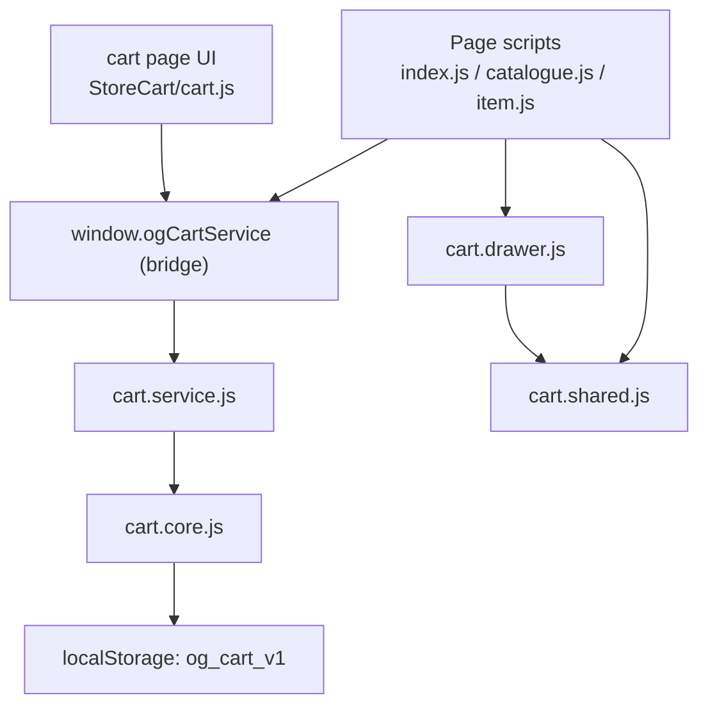

# Cart Consolidation Plan (StoreWebsite)

Scope: StoreWebsite only. This document formalizes the approved, low-risk consolidation plan for the cart system.

Constraints preserved:
- `localStorage` key `og_cart_v1`
- 15-minute price lock behavior
- Existing UI/UX behavior
- Browser-static compatibility (no framework rewrite)

## Canonical Cart Architecture (Keep)
Source of truth:
- `StoreWebsite/StoreCart/cart.core.js`
- `StoreWebsite/StoreCart/cart.service.js`

Required globals (must remain intact):
- `window.ogCartDrawerOpen` in `StoreWebsite/StoreCart/cart.drawer.js`
- `window.ogCartDrawerClose` in `StoreWebsite/StoreCart/cart.drawer.js`
- `window.ogCartBadgeRefresh` in `StoreWebsite/StoreCart/cart.shared.js`

Cart page UI remains in:
- `StoreWebsite/StoreCart/cart.js` (should delegate to `cart.core.js`/`cart.service.js`)

## Duplicated Functions to Remove
From `StoreWebsite/index.js`:
- `getCart`
- `setCart`
- `makePriceLock`
- `upsertCartItem`
- `openCartDrawerSoft`

From `StoreWebsite/catalogue.js`:
- `getCart`
- `setCart`
- `makePriceLock`
- `upsertCartItem`
- `openCartDrawerSoft`

From `StoreWebsite/item.js`:
- `getCart`
- `setCart`
- `makePriceLock`
- `upsertCartItem`

From `StoreWebsite/StoreCart/cart.js`:
- `createEmptyCart`
- `normalizeCart`
- `loadCart`
- `saveCart`
- `createPriceLock`
- `isLockExpired`
- `cartQtySum`
- `refreshExpiredLocks`
- `setQty`
- `incQty`
- `removeLine`
- `clearCart`

## Step-by-Step Migration (Safe Order)

### Step 1 — Add a browser-static bridge for `cart.service`
Files to modify:
- Add `StoreWebsite/StoreCart/cart.service.global.js`
- Update script order in:
  - `StoreWebsite/index.html`
  - `StoreWebsite/catalogue.html`
  - `StoreWebsite/item.html`
  - `StoreWebsite/StoreCart/cart.html`

What to replace with (which `cart.service` function):
- No behavioral replacements yet. This step exposes a global API bridge:
  - `window.ogCartService = { addToCart, setCartQty, removeFromCart, getCart, getCartBadgeCount, refreshExpiredPriceLocks, computeCartTotals }`

Globals that must remain intact:
- `window.ogCartDrawerOpen`
- `window.ogCartDrawerClose`
- `window.ogCartBadgeRefresh`

Checklist:
- [ ] Create `StoreWebsite/StoreCart/cart.service.global.js` that exports `window.ogCartService`
- [ ] Ensure it is loaded before page scripts that add to cart
- [ ] Verify no module conversion is required for existing page scripts

### Step 2 — Replace add-to-cart in `StoreWebsite/index.js`
Files to modify:
- `StoreWebsite/index.js`

Replace with `cart.service`:
- `upsertCartItem(...)` → `window.ogCartService.addToCart(id, qtyDelta, currentPrice)`
- `getCart`/`setCart`/`makePriceLock` → remove

Globals that must remain intact:
- `window.ogCartDrawerOpen`
- `window.ogCartBadgeRefresh`

Checklist:
- [ ] Replace add-to-cart logic with `window.ogCartService.addToCart(...)`
- [ ] Remove duplicate local cart helper functions
- [ ] Keep drawer open behavior unchanged
- [ ] Call `window.ogCartBadgeRefresh()` after add

### Step 3 — Replace add-to-cart in `StoreWebsite/catalogue.js`
Files to modify:
- `StoreWebsite/catalogue.js`

Replace with `cart.service`:
- `upsertCartItem(...)` → `window.ogCartService.addToCart(id, qtyDelta, currentPrice)`
- `getCart`/`setCart`/`makePriceLock` → remove

Globals that must remain intact:
- `window.ogCartDrawerOpen`
- `window.ogCartBadgeRefresh`

Checklist:
- [ ] Replace add-to-cart logic with `window.ogCartService.addToCart(...)`
- [ ] Remove duplicate local cart helper functions
- [ ] Keep drawer open behavior unchanged
- [ ] Call `window.ogCartBadgeRefresh()` after add

### Step 4 — Replace add-to-cart in `StoreWebsite/item.js`
Files to modify:
- `StoreWebsite/item.js`

Replace with `cart.service`:
- `upsertCartItem(...)` → `window.ogCartService.addToCart(id, qtyDelta, currentPrice)`
- `getCart`/`setCart`/`makePriceLock` → remove

Globals that must remain intact:
- `window.ogCartDrawerOpen`
- `window.ogCartBadgeRefresh`

Checklist:
- [ ] Replace add-to-cart logic with `window.ogCartService.addToCart(...)`
- [ ] Remove duplicate local cart helper functions
- [ ] Keep drawer open behavior unchanged
- [ ] Call `window.ogCartBadgeRefresh()` after add

### Step 5 — Consolidate cart page logic in `StoreWebsite/StoreCart/cart.js`
Files to modify:
- `StoreWebsite/StoreCart/cart.js`

Replace with `cart.service` / `cart.core`:
- `createEmptyCart`/`loadCart`/`saveCart`/`normalizeCart`/`createPriceLock`/`isLockExpired` → use `cart.core.js` or `cart.service.getCart()`
- `cartQtySum` → `cart.core.getCartQuantity()` or `window.ogCartService.getCartBadgeCount()`
- `setQty` → `window.ogCartService.setCartQty(id, qty)`
- `incQty` → `window.ogCartService.setCartQty(id, currentQty + delta)`
- `removeLine` → `window.ogCartService.removeFromCart(id)`
- `clearCart` → `cart.core.clearCart()`
- `refreshExpiredLocks` → `window.ogCartService.refreshExpiredPriceLocks(resolver)`

Globals that must remain intact:
- `window.ogCartBadgeRefresh`

Checklist:
- [ ] Replace local cart storage functions with `cart.core`/`cart.service`
- [ ] Ensure lock refresh uses `refreshExpiredPriceLocks` with existing resolver
- [ ] Preserve UI rendering and countdown behavior
- [ ] Keep badge repainting consistent

### Step 6 — Remove duplicated helpers from page scripts
Files to modify:
- `StoreWebsite/index.js`
- `StoreWebsite/catalogue.js`
- `StoreWebsite/item.js`

Checklist:
- [ ] Delete duplicated helper functions after replacement
- [ ] Verify no references remain to removed helpers

### Step 7 — Verify drawer + badge integration
Files to verify:
- `StoreWebsite/StoreCart/cart.drawer.js`
- `StoreWebsite/StoreCart/cart.shared.js`
- `StoreWebsite/index.html`
- `StoreWebsite/catalogue.html`
- `StoreWebsite/item.html`
- `StoreWebsite/StoreCart/cart.html`

Checklist:
- [ ] `window.ogCartDrawerOpen` still works from page scripts
- [ ] `window.ogCartBadgeRefresh` is called after add-to-cart
- [ ] Drawer script order is unchanged except for the new service bridge

## Risk Warnings
- Event wiring: `data-action="add-to-cart"` handlers must now call `window.ogCartService.addToCart`.
- Price-lock drift: Use `setCartQty` for quantity changes to avoid resetting locks unintentionally.
- Badge updates: If `window.ogCartBadgeRefresh` is not called post-add, UI counts may drift.
- Script order: The bridge must load before page scripts that call `window.ogCartService`.
- Inventory hydration: `refreshExpiredPriceLocks` requires a resolver; keep existing inventory map behavior.
- Storage contract: `og_cart_v1` key must remain unchanged across all modules.

## Rollback Strategy
If a regression is detected:
1. Revert the most recent step only (keep earlier steps intact).
2. Restore the previous script order if a bridge load issue is suspected.
3. Re-enable the removed helper functions in the affected page file only.
4. Confirm `og_cart_v1` is still readable and that `window.ogCartBadgeRefresh` updates counts.

## Definition of Done
- All add-to-cart flows use `cart.service.js` via `window.ogCartService`.
- No duplicated cart helpers exist in `StoreWebsite/index.js`, `StoreWebsite/catalogue.js`, or `StoreWebsite/item.js`.
- `StoreWebsite/StoreCart/cart.js` delegates to `cart.core.js`/`cart.service.js`.
- `og_cart_v1` storage key and 15-minute lock behavior are unchanged.
- Drawer and badge globals (`window.ogCartDrawerOpen`, `window.ogCartDrawerClose`, `window.ogCartBadgeRefresh`) remain intact and functional.

## Final Target Architecture (Cart Only)

