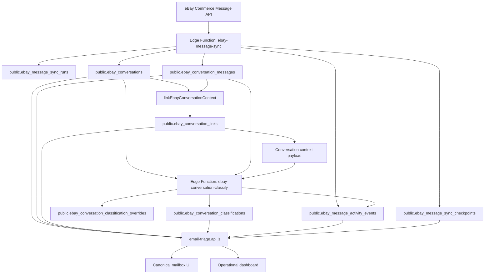
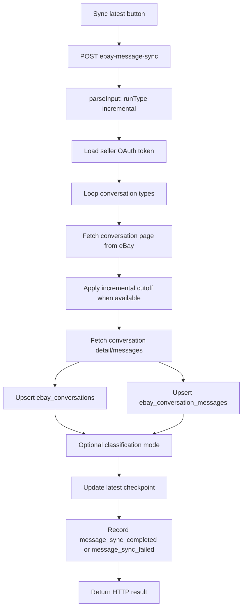
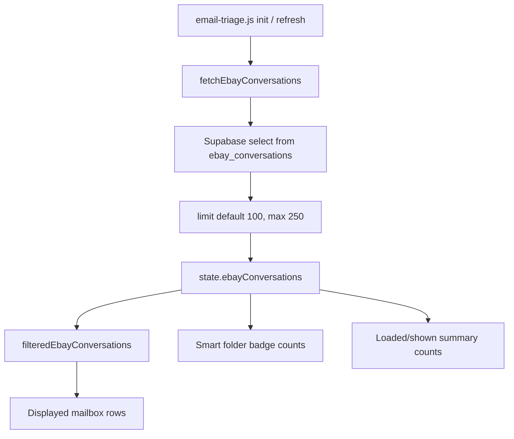

# Step 5F.6A Canonical Sync Architecture Audit

Audit date: 2026-06-03

Scope: full repository architecture audit only. No production code, migrations, Edge Functions, UI, database objects, deployments, eBay state, Outlook state, secrets, or tokens were changed.

Deliverable: technical audit for canonical eBay sync, archive backfill, mailbox rendering, smart folder counts, dashboard events, pagination, classification, read/unread state, and 5F.6P readiness.

## Executive Summary

The eBay canonical messaging foundation exists and is functional:

```text
eBay Commerce Message API
-> ebay-message-sync Edge Function
-> ebay_conversations / ebay_conversation_messages
-> context linking
-> ebay_conversation_classifications
-> canonical mailbox UI
-> operational dashboard events
```

The current system can ingest eBay conversations, persist canonical messages, classify conversations, backfill archive pages with checkpoints, run latest sync, show a mailbox, and render dashboard activity.

However, the current mailbox and operations model is not yet a true canonical read model. The database can contain more conversations than the mailbox shows, smart folder counts are computed from loaded frontend rows rather than the full canonical table, read/unread state is local-only and intentionally preserved during sync, and sync/backfill completion is not reconciled against browser fetch failures.

The supplied production observations are explained by the inspected implementation:

| Observation | Explanation |
| --- | --- |
| `public.ebay_conversations` count is `300` | Canonical conversation rows exist in the database. Dashboard canonical count and Edge Function sync summaries count this table directly. |
| `public.ebay_conversation_messages` count is `888` | Canonical message rows exist in the database. Message timeline and context summaries are loaded from this table for loaded/selected conversations. |
| `conversation_source` does not exist on `public.ebay_conversations` | Source is not a canonical conversation column. The canonical source signal is `conversation_type` (`FROM_MEMBERS` or `FROM_EBAY`). `conversation_source` exists on `public.ebay_conversation_classifications`, and the frontend also derives effective source from `conversation_type`. |
| Sync Latest: `Seen: 1`, `Inserted: 0`, `Updated: 0`, `Unchanged: 1`, `Canonical Total: 300` | The latest sync fetched one already-known conversation in the latest window/page. It found no new messages and no latest-message change, so it counted the row as unchanged. The canonical total is a table count after the run. |
| Backfill UI: `Failed to fetch`; dashboard: `Backfill Progress` `Succeeded` | The browser request can fail or time out after the Edge Function has already committed checkpoint/event updates. The dashboard reads durable database events/checkpoints, while the UI toast reflects the HTTP request outcome. |
| Database has `300` conversations; mailbox shows `100` | The canonical mailbox loader defaults to `limit: 100`, replaces the frontend state with one limited query, and has no canonical Load More, infinite scroll, cursor, or exact count-backed page model. |

Readiness assessment for 5F.6P Live Sync + Read/Unread Synchronization:

```text
Not Ready
```

The ingestion and classification substrate is mostly present, but 5F.6P depends on reliable provider read/unread reconciliation, exact mailbox counts, robust latest sync semantics, and a dashboard/UI run-status contract. Those are not in place yet.

## Evidence Reviewed

Primary schema and migration files reviewed:

- `supabase/migrations/20260528120000_ebay_canonical_messaging.sql`
- `supabase/migrations/20260528170000_ebay_conversation_classification.sql`
- `supabase/migrations/20260528183000_ebay_conversation_saved_views.sql`
- `supabase/migrations/20260601183000_ebay_message_audit_operations.sql`
- `supabase/migrations/20260602133000_ebay_conversation_source_classification.sql`
- `supabase/migrations/20260602170000_email_triage_classification_ux_finalization.sql`
- `supabase/migrations/20260602183000_ebay_message_backfill_checkpoints.sql`
- `supabase/migrations/20260603120000_ebay_message_sync_aggregate_events.sql`
- `supabase/migrations/20260603133000_ebay_backfill_chunked_progress.sql`

Primary Edge Functions and shared modules reviewed:

- `supabase/functions/ebay-message-sync/index.ts`
- `supabase/functions/ebay-conversation-classify/index.ts`
- `supabase/functions/ebay-conversation-context/index.ts`
- `supabase/functions/ebay-conversation-draft/index.ts`
- `supabase/functions/_shared/ebay-conversation-context.ts`
- `supabase/config.toml`

Primary frontend files reviewed:

- `email-triage.html`
- `email-triage.js`
- `email-triage.api.js`
- `email-triage.classifications.js`
- `email-triage.diagnostics.js`

This audit also incorporates the supplied SQL observations for the live database counts and the failed `conversation_source` query.

## 1. Current Architecture

### Current End-To-End Flow



### Canonical Tables

`public.ebay_conversations` is the canonical conversation table. It stores one row per seller account, eBay conversation type, and eBay conversation id. The uniqueness contract is:

```text
(seller_account_id, conversation_type, ebay_conversation_id)
```

Important columns include:

- `conversation_type`: `FROM_MEMBERS` or `FROM_EBAY`
- `conversation_status`
- `conversation_title`
- `other_party_username`
- `reference_id`
- `reference_type`
- `unread_count`
- `latest_message_id`
- `latest_message_created_at`
- `first_message_created_at`
- `last_message_created_at`
- `message_count`
- sync run ids and raw metadata

`public.ebay_conversation_messages` is the canonical message table. Its uniqueness contract is:

```text
(seller_account_id, conversation_type, ebay_conversation_id, ebay_message_id)
```

Important columns include:

- `direction`
- `sender_username`
- `recipient_username`
- `subject`
- `body_text`
- `body_preview`
- `read_status`
- `is_read`
- `message_status`
- `created_at_ebay`
- media and raw metadata

### Conversation Source Reality

There is no `conversation_source` column on `public.ebay_conversations`. The supplied query failure is correct and expected for the current schema.

The current source model is split:

| Source concept | Current implementation |
| --- | --- |
| Canonical conversation source | `ebay_conversations.conversation_type` |
| Classification source | `ebay_conversation_classifications.conversation_source` |
| Frontend effective source | Derived by `ebayConversationSource(conversation)` from `conversation_type` and platform identity heuristics |
| Saved view definitions in migrations | Use classification `conversation_source` for Members / eBay Notifications metadata |

The migration `20260602133000_ebay_conversation_source_classification.sql` added `conversation_source` to classifications, not conversations. It backfilled classification source from `ebay_conversations.conversation_type`:

```text
FROM_EBAY -> platform_notification
FROM_MEMBERS -> member_message
```

The frontend does not need `ebay_conversations.conversation_source`; it derives effective source from canonical fields and normalizes it into each loaded conversation object.

### Registered eBay Message Functions

`supabase/config.toml` registers the relevant eBay functions with JWT verification:

- `ebay-message-probe`
- `ebay-message-sync`
- `ebay-conversation-context`
- `ebay-conversation-classify`
- `ebay-conversation-draft`

The sync function is read-only with respect to eBay. It reads conversations and messages from eBay and writes normalized rows/events/checkpoints to Supabase.

## 2. Sync Latest Architecture

### UI Entry Point

The "Sync latest eBay conversations" control calls `runEbayMessageSync` from `email-triage.api.js`, which posts to `supabase/functions/ebay-message-sync/index.ts`.

The current latest sync request shape is effectively:

```text
runType: incremental
conversationTypes: FROM_MEMBERS, FROM_EBAY
conversationPageLimit: 25
messagePageLimit: 25
maxConversationPages: 1
checkpointScope: commerce_message_latest_sync
latestSyncLookbackDays: 14
readOnly: true
```

### Checkpoint Scope

Latest sync uses the checkpoint scope:

```text
commerce_message_latest_sync
```

Checkpoint rows are keyed by:

```text
(seller_account_id, checkpoint_scope, conversation_type)
```

The latest checkpoint stores:

- status
- next offset
- total available
- processed page/conversation/message counters
- last conversation timestamp
- last run id
- error details
- metadata

For incremental sync, the function uses checkpoint `lastConversationTimestamp` as the latest cutoff fallback. It does not resume from checkpoint offset in the same way archive backfill does. Incremental offset starts from the request start offset.

### Data Flow



### eBay Request Behavior

For `FROM_MEMBERS`, the request path includes `start_time` and `end_time` for latest/incremental sync when a cutoff exists.

For `FROM_EBAY`, the request path does not include time parameters. The function fetches the first page and applies filtering after fetch.

This means latest sync is not equally latest-constrained for both eBay source types.

### Insert Path

When a fetched conversation does not already exist for the seller account, conversation type, and eBay conversation id:

1. A new `ebay_conversations` row is inserted.
2. Messages are inserted into `ebay_conversation_messages`.
3. Conversation/message counts are added to the sync run summary.
4. Optional classification may run depending on `classificationMode`.

For a new conversation, the API's `unreadCount` and message read fields are accepted into the canonical rows.

### Update Path

When a fetched conversation already exists:

1. The function compares latest message identity/timestamp and inserted message count.
2. If there are new messages or latest-message changes, the conversation is counted as updated.
3. If there are no new messages and no latest-message change, it is counted as unchanged.

Important read-state behavior:

```text
Existing conversation unread_count is preserved.
Existing message read_status / is_read are preserved.
```

That local preservation is intentional for current local-read UX, but it blocks provider read/unread synchronization.

### Event Path

For batch sync runs, per-conversation sync activity is suppressed by metadata. Instead, the function records aggregate activity events:

- `message_sync_completed`
- `message_sync_failed`

The dashboard maps `message_sync_completed` to "Sync Latest Completed".

### Is Sync Latest Truly Latest-Only?

Current answer:

```text
Mostly for FROM_MEMBERS, not fully for the whole canonical system.
```

Confirmed reasons:

1. `FROM_MEMBERS` uses a time-window request when a cutoff exists.
2. `FROM_EBAY` does not use time parameters in the request path and relies on first-page fetch plus post-fetch filtering.
3. Latest sync is capped to one conversation page per type by current UI/default behavior.
4. Incremental sync uses checkpoint timestamp as a cutoff but does not use checkpoint offset as an incremental resume cursor.
5. The result can be a "page 0 latest check" rather than a complete "fetch all changes since checkpoint" pass.

### Observed Sync Latest Result Explained

Observed:

```text
Sync Latest Completed
Seen: 1
Inserted: 0
Updated: 0
Unchanged: 1
Canonical Total: 300
```

Explanation:

1. eBay returned one conversation in the latest fetch window/page.
2. That conversation already existed in `public.ebay_conversations`.
3. No new canonical messages were inserted.
4. The latest message identity/timestamp did not change.
5. The function counted it as unchanged.
6. The function counted `public.ebay_conversations` after the run and returned `300` as the canonical total.

This result is not evidence that only one canonical conversation exists. It is evidence that one latest candidate was seen in that invocation.

## 3. Historical Backfill Architecture

### UI Entry Points

The current UI exposes archive backfill variants:

- Backfill archive
- Backfill + classify new
- Backfill + reclassify all

Those controls call the same `ebay-message-sync` Edge Function with:

```text
runType: backfill
checkpointScope: commerce_message_archive
conversationTypes: FROM_MEMBERS, FROM_EBAY
resumeFromCheckpoint: true
classificationMode: none | classify_new | reclassify_all
```

### Chunking

Archive backfill is chunked by conversation type and offset. The sync function bounds request sizes:

- conversation page limit: 1 to 50
- message page limit: 1 to 50
- backfill chunk page default: 1 page
- backfill chunk max: 5 pages

The current UI path uses small chunks. In practice, that means a backfill invocation processes a bounded number of conversation pages per conversation type, then records progress and pauses/resumes through checkpoints.

### Checkpointing

Backfill checkpoint scope:

```text
commerce_message_archive
```

Checkpoint key:

```text
(seller_account_id, checkpoint_scope, conversation_type)
```

Checkpoint fields include:

- `status`: `running`, `succeeded`, `failed`, `paused`
- `next_offset`
- `total_available`
- `pages_processed`
- `conversations_processed`
- `messages_processed`
- `last_conversation_timestamp`
- `last_run_id`
- `last_error`
- `metadata`

The migration `20260602183000_ebay_message_backfill_checkpoints.sql` introduced archive checkpoints. The migration `20260603133000_ebay_backfill_chunked_progress.sql` added the `paused` status and progress event type.

### Resume Logic

For backfill, the sync function starts each conversation type from checkpoint `next_offset` when `resumeFromCheckpoint` is true.

After each processed page, the function advances the offset by page limit. If the current invocation hits the chunk page cap before eBay reports exhaustion, the checkpoint is left in a resumable state:

```text
status: paused
next_offset: next page offset
```

If eBay reports there are no more pages for that type, the checkpoint is marked:

```text
status: succeeded
```

Backfill completion across the whole archive is derived from all requested conversation type checkpoints. A backfill is only fully complete when every requested type is succeeded.

### Classification Modes

Backfill can classify during chunk processing:

| Mode | Behavior |
| --- | --- |
| `none` | Persist conversations/messages only. |
| `classify_new` | Classify processed conversations that do not have any existing classification rows. |
| `reclassify_all` | Force reclassification for processed conversations in the current chunk. |

Backfill classification calls `ebay-conversation-classify` with activity-event suppression. The backfill aggregate event metadata carries classification counters instead of emitting a classification event per conversation.

### Dashboard Events

Backfill event types in schema:

- `message_backfill_started`
- `message_backfill_progress`
- `message_backfill_completed`
- `message_backfill_failed`

Current function behavior:

- Progress chunks record `message_backfill_progress`.
- Completed archive runs record `message_backfill_completed`.
- Failed runs record `message_backfill_failed`.
- The `message_backfill_started` event type exists, but the inspected sync handler does not currently record a durable started event at the beginning of a backfill invocation.

### Current Backfill Status Interpretation

Dashboard "Backfill Progress Succeeded" can mean:

```text
A backfill chunk succeeded and checkpoint progress was saved.
```

It does not necessarily mean:

```text
The entire historical archive has finished for every conversation type.
```

The durable checkpoint summary is the correct place to determine full archive completion.

## 4. Canonical Mailbox Architecture

### Mailbox Data Flow



### Count Types

| Count | Current source | Current behavior |
| --- | --- | --- |
| Canonical conversation count | DB count of `public.ebay_conversations`; Edge Function `countCanonicalConversations`; dashboard exact count | Supplied observation: `300`. This is the real canonical table count. |
| Canonical message count | DB count of `public.ebay_conversation_messages` | Supplied observation: `888`. This is the real canonical message table count. |
| Loaded count | `state.ebayConversations.length` | Normally `100`, because `loadEbayConversationList` calls `fetchEbayConversations` with default `limit: 100`. Backfill reload can request up to `250`. |
| Displayed count | `filteredEbayConversations(state).length` | Client-side search and smart-folder filter result from loaded rows only. |
| Smart folder badge counts | `ebaySavedViewCount(state, view)` over loaded rows | Loaded-row-derived. Not exact against all canonical rows. |
| Dashboard canonical count | `fetchOperationalDashboard` exact Supabase count | DB-derived and currently authoritative for total canonical conversations. |

### Why The Mailbox Shows 100 When The Database Has 300

`fetchEbayConversations(context, values = {})` in `email-triage.api.js` computes:

```text
limit = min(max(values.limit || 100, 1), 250)
```

It then queries `public.ebay_conversations` with:

```text
order latest_message_created_at desc nulls last
order updated_at desc
limit(limit)
```

There is no exact count request, no range, no offset, no keyset cursor, and no "load more" state for the canonical eBay conversation list.

`loadEbayConversationList(context)` in `email-triage.js` calls this API with default `100` on initial load and refresh. It replaces `state.ebayConversations` with the returned rows. Therefore, with `300` canonical rows in the database, the ordinary mailbox view loads and shows only the newest `100`.

### Classification And Context In The Mailbox

For the loaded conversation ids only, the API fetches:

- conversation links
- messages
- seller accounts
- current classifications

It then builds per-conversation summaries for the loaded rows. Link-derived and message-derived smart-folder fields only exist for the loaded page.

## 5. Smart Folder Architecture

### Current Global Rule

All canonical eBay smart folder badge counts in the mailbox are currently:

```text
loaded-row-derived
```

Some smart folder predicates use classification fields, some use link/message summaries, and some use deterministic source/read fields. But the badge count itself is computed over `state.ebayConversations`, not over the full database.

### Folder Rules

| Folder | Current rule | Predicate data source | Count source | Notes |
| --- | --- | --- | --- | --- |
| All | Every loaded conversation | Loaded rows from `ebay_conversations` | Loaded-row-derived | Does not show canonical total unless all rows are loaded. |
| Members | `ebayConversationSource(conversation) === "member_message"` | Deterministic source derived from `conversation_type` and participant/platform heuristics | Loaded-row-derived | This does not require `ebay_conversations.conversation_source`. |
| eBay Notifications | `ebayConversationSource(conversation) === "platform_notification"` | Deterministic source derived from `conversation_type` and platform heuristics | Loaded-row-derived | Maps primarily to `FROM_EBAY`. |
| Unread | `Number(conversation.unread_count) > 0` | Loaded conversation row, with optimistic local UI mutation possible | Loaded-row-derived | Not provider-synchronized for existing rows. |
| Returns | AI topic contains `return` | `ebay_conversation_classifications.ai_topic_tags` | Loaded-row-derived and classification-derived | Current code does not include `summary.has_return_link`, even though saved-view migration describes return-linked or return-classified conversations. |
| Shipping | AI topic contains `shipping_issue`, `missing_item`, `order_status`, or `delivery_timing` | Classification topic tags | Loaded-row-derived and classification-derived | Depends on current classification for loaded rows. |
| Reply Today | effective response need is `reply_today` | Classification `response_need` | Loaded-row-derived and classification-derived | Depends on current classification. |
| VIP | buyer flag contains `vip_buyer` | Classification buyer flags | Loaded-row-derived and classification-derived | Depends on current classification. |
| High Value | buyer flag contains `high_value_buyer` or `high_retained_value_buyer` | Classification buyer flags | Loaded-row-derived and classification-derived | Depends on current classification. |
| Refund Risk | risk flag contains `refund_risk`, `chargeback_risk`, or `unsupported_claim_risk` | Classification risk flags | Loaded-row-derived and classification-derived | Depends on current classification. |
| Has Order | `summary.has_order_link` | Link summary built from loaded `ebay_conversation_links` | Loaded-row-derived and link-derived | Only true for loaded rows whose links were fetched. |
| Has Media | `summary.has_media` | Message summary built from loaded `ebay_conversation_messages` | Loaded-row-derived and message-derived | Only true for loaded rows whose messages were fetched. |
| Needs Review | `summary.needs_context_review` | Loaded context summary: no links or suggested links exist | Loaded-row-derived and link/context-derived | This is distinct from the broader `Review queue` saved view. |

Additional saved view present in the repository:

| Folder | Current rule | Notes |
| --- | --- | --- |
| Review queue | No classification, stale classification, `summary.needs_context_review`, or low-confidence/context-review risk flags | Broader than `Needs Review`; mixes classification freshness and context-review signals. |
| Has Return | `summary.has_return_link` | Exists in saved view definitions and frontend code, even though it was not in the required user list. |

### Key Inconsistency

The migration-defined saved views and the frontend saved-view rules are not a single shared source of truth. The frontend computes the active mailbox badges and filters locally from loaded rows. The database stores saved-view metadata, but the mailbox does not ask the database for exact saved-view counts against all canonical rows.

## 6. Dashboard Event Architecture

### Event Storage

Dashboard activity is stored in:

```text
public.ebay_message_activity_events
```

The event system records sync, classification, draft, approval, send, and backfill activity. Aggregate sync/backfill event types were added to reduce noisy per-conversation logging during batch operations.

### Event Lifecycle

| Lifecycle stage | Current implementation |
| --- | --- |
| Started | `message_backfill_started` exists in schema, but the inspected backfill handler does not currently emit it. Sync latest does not have a clearly equivalent aggregate started event in the inspected path. |
| Progress | Backfill chunks emit `message_backfill_progress` when progress is saved but the archive is not fully exhausted. |
| Completed | Latest sync emits `message_sync_completed`; full archive completion emits `message_backfill_completed`. |
| Failed | Latest sync emits `message_sync_failed`; archive backfill emits `message_backfill_failed`. |

### Dashboard Sources

`fetchOperationalDashboard` in `email-triage.api.js` reads:

- exact canonical conversation count from `ebay_conversations`
- exact unread count from `ebay_conversations`
- current classifications from `ebay_conversation_classifications`
- drafts, approvals, send attempts
- recent `ebay_message_activity_events`
- backfill checkpoint rows from `ebay_message_sync_checkpoints`

The dashboard latest-sync and backfill cards are therefore database-derived, not derived from the last browser request state.

### Why `Failed to fetch` Can Coexist With `Succeeded`

The backfill button starts a browser `fetch` to an Edge Function. The Edge Function can:

1. fetch eBay pages,
2. upsert conversations/messages,
3. update checkpoints,
4. record `message_backfill_progress` or `message_backfill_completed`,
5. then return an HTTP response.

If the browser request times out, the network connection drops, or the Supabase function response is otherwise not delivered, the UI sees:

```text
Failed to fetch
```

But the durable database event/checkpoint may already have been committed. The dashboard then reads that durable state and can show:

```text
Backfill Progress
Succeeded
```

Both statements can be true:

- The browser request failed from the UI's perspective.
- The server-side backfill chunk succeeded and recorded durable progress.

### Source Of Truth

For actual data mutation and archive progress, the source of truth is:

```text
public.ebay_message_sync_runs
public.ebay_message_sync_checkpoints
public.ebay_message_activity_events
public.ebay_conversations
public.ebay_conversation_messages
```

The HTTP fetch result is only the source of truth for whether that browser request received a response.

The current UI does not reconcile a failed request with post-request dashboard/checkpoint state. That is the architecture reason operators can see contradictory statuses.

## 7. Pagination Audit

### Current Page Size

The canonical mailbox API default is:

```text
100 conversations
```

The API clamps the requested limit to:

```text
1..250
```

Normal initial load and refresh use `100`. Backfill reloads can request `250`. The database currently has `300` canonical conversations, so neither default load nor backfill reload is guaranteed to show all rows.

### Current Load Strategy

Current canonical load strategy:

```text
single Supabase query
order by latest_message_created_at desc nulls last
order by updated_at desc
limit N
replace state.ebayConversations
```

Related rows are fetched only for the loaded conversation ids:

- links
- messages
- seller accounts
- classifications

### Infinite Scroll Implementation

No canonical eBay infinite scroll implementation was found.

There is no canonical eBay:

- `IntersectionObserver`
- scroll sentinel
- keyset cursor
- paged append operation
- "has more" state
- exact count versus loaded count contract

### Load More Implementation

No canonical eBay "Load More" implementation was found.

The current controls refresh or reload the first limited page. They do not append the next page.

### Correctness Assessment

Current answer:

```text
Not correct for canonical mailbox scale.
```

The database count and mailbox count can diverge by design. The current model is acceptable for an early 100-row preview, but not for a canonical mailbox that needs exact smart folder counts, unread accuracy, and live-sync readiness.

## 8. Read / Unread Audit

### Current Persistence Model

Read/unread is stored in:

```text
ebay_conversations.unread_count
ebay_conversation_messages.read_status
ebay_conversation_messages.is_read
```

The canonical messaging migration includes indexes for unread conversations and read/message timeline access.

### Current UI Behavior

When an operator selects a conversation, `email-triage.js` calls a local mark-read path:

1. Optimistically set the loaded conversation `unread_count` to `0` in frontend state.
2. Normalize selected messages as read in the UI if the selected conversation has no unread count.
3. Call `markEbayConversationRead` in `email-triage.api.js`.
4. `markEbayConversationRead` calls the Supabase RPC `mark_ebay_conversation_read`.

The RPC:

- requires admin authorization,
- sets `ebay_conversations.unread_count = 0`,
- sets all messages in that conversation to `read_status = 'Read'` and `is_read = true`,
- returns `local_only: true`.

It does not mutate eBay/provider read state.

### Current Sync Behavior

During sync, existing local read state is preserved:

```text
Existing conversation unread_count is preserved.
Existing message read_status and is_read are preserved.
```

That means:

- Provider unread changes for existing conversations do not flow into the canonical conversation row.
- Provider read changes for existing messages do not flow into canonical message rows.
- A newly fetched message may carry provider read status, but the parent existing conversation's `unread_count` can remain stale because the existing conversation unread count is preserved.

### Current Limitations

Confirmed limitations:

1. There is no provider read/unread mutation.
2. There is no provider read/unread reconciliation.
3. There is no separate model for provider-observed state versus local/operator state.
4. There is no pending read/unread mutation queue.
5. There is no rollback of optimistic local mark-read if the RPC fails.
6. There is no conflict policy for "operator marked read locally, provider later says unread" or "provider marked read elsewhere, local state says unread".

### 5F.6P Interaction

5F.6P cannot safely add live read/unread synchronization on top of the current preservation logic. The current sync path explicitly prevents provider read state from updating existing rows.

Before 5F.6P, the system needs a state model that distinguishes:

- provider-observed read/unread state,
- local displayed read/unread state,
- operator-requested pending mutations,
- last provider sync timestamp,
- last local mutation timestamp,
- mutation result/audit status.

## 9. Classification Audit

### Classification Tables

`public.ebay_conversation_classifications` stores conversation-level AI output. It supports:

- current/non-current rows,
- topic tags,
- buyer flags,
- risk flags,
- priority,
- response need,
- summary,
- confidence,
- review state,
- conversation source,
- validation metadata,
- operator override metadata.

A unique partial index enforces one current classification per conversation.

### Classification Function Modes

`ebay-conversation-classify` supports:

| Mode | Behavior |
| --- | --- |
| `taxonomy_audit` | Return taxonomy metadata. |
| `classify_conversation` | Classify one conversation. Reuses current/fresh matching classification unless forced. |
| `classify_recent` | Query latest conversations, classify skipped/unclassified/stale rows according to limit and force flag. |
| `review_override` | Apply manual review/override metadata and record override rows. |

### Backfill Classification

Backfill classification is driven by `ebay-message-sync`:

| Backfill mode | Behavior |
| --- | --- |
| `none` | No classification during backfill. |
| `classify_new` | Classify processed conversations that have no existing classification rows. |
| `reclassify_all` | Force reclassification for processed conversations in the current backfill chunk. |

Backfill classification suppresses per-row activity events and relies on aggregate backfill event metadata.

### Classify New

The UI "Classify unclassified" action uses `classify_recent` with a bounded limit. The frontend computes a limit from the loaded count and caps it at `100`.

Therefore, this action classifies recent/inbox-limited conversations, not necessarily every unclassified conversation in the canonical database.

### Reclassify All / Reclassify Inbox

There are two different operator ideas:

1. "Reclassify inbox" in the regular mailbox controls.
2. "Backfill + reclassify all" in the archive backfill controls.

Current behavior:

- "Reclassify inbox" calls `classify_recent` with `force: true` and a maximum effective limit of `100`.
- "Backfill + reclassify all" force-classifies conversations processed by the current backfill chunk. Over repeated chunks it can eventually cover the archive, but each invocation only covers processed rows.

So "all" is not a single global all-canonical reclassification action in the current UI path.

### Manual Classification

Manual classification/review overrides update current classification review metadata and insert override records. This path is separate from sync/backfill classification and is audited through classification activity infrastructure.

### Duplication And Inconsistency

Confirmed areas of duplication/inconsistency:

1. Source classification is stored in `ebay_conversation_classifications.conversation_source`, but the frontend derives effective source from `ebay_conversations.conversation_type`.
2. Saved view metadata exists in database migrations, but active smart folder counts/filters are frontend-loaded-row computations.
3. Backfill classification and `classify_recent` both classify conversations, but they target different row scopes and emit different aggregate activity.
4. "Reclassify inbox" wording can imply broader coverage than the current max-100 recent-row scope.
5. The Returns smart folder predicate in frontend does not match the saved-view description that includes return-linked conversations.

## 10. Confirmed Bugs

Only confirmed bugs and confirmed architecture inconsistencies are listed here. Suspected issues are excluded.

| Priority | Problem | Root Cause | Impact |
| --- | --- | --- | --- |
| High | Canonical mailbox shows only 100 conversations while the database has 300. | `fetchEbayConversations` defaults to `limit: 100`; `loadEbayConversationList` loads one limited page and replaces state. | Operators cannot see the full canonical mailbox through normal load/refresh. Search and selection are limited to the first page. |
| High | Canonical eBay mailbox has no Load More or infinite scroll. | No cursor, range, offset, append state, or scroll sentinel exists for canonical conversations. | The UI has no way to navigate all canonical rows once the table exceeds the first loaded page. |
| High | Smart folder badge counts are not canonical counts. | `ebaySavedViewCount` filters `state.ebayConversations`, which contains only loaded rows. | Folder badges undercount and can mislead operators about unread, returns, shipping, VIP, risk, and review workload. |
| High | Local read state masks provider read/unread updates for existing conversations/messages. | `ebay-message-sync` preserves existing `unread_count`, `read_status`, and `is_read` during upsert. | Live read/unread sync cannot work correctly; new provider unread state can be hidden behind stale local state. |
| Medium-High | Backfill request failure is not reconciled with durable success. | UI treats browser `fetch` failure as operation failure and does not poll/check durable run/checkpoint/event state after failure. | Operators can see "Failed to fetch" while the dashboard shows a succeeded backfill progress event, with no clear source-of-truth guidance in the UI. |
| Medium-High | "Reclassify inbox" scope is narrower than the label implies. | The UI calls `classify_recent` with force enabled and an effective max of 100 recent rows. | Operators may believe all canonical/inbox conversations were reclassified when only the recent limited set was targeted. |
| Medium-High | Returns smart folder implementation does not match saved-view description. | Frontend `returns` predicate checks AI topic `return` but not `summary.has_return_link`. | Return-linked conversations without a return topic can be omitted, and topic-only rows can be included without a return link. |
| Medium | Sync Latest is not fully latest-only across conversation types. | `FROM_MEMBERS` can use time-window request parameters; `FROM_EBAY` does not use time parameters and latest sync is capped to first page/filtering. | Latest sync can miss older changed notification rows beyond the first page or behave differently by source type. |
| Medium | Optimistic mark-read has no rollback on RPC failure. | The frontend mutates local state before the RPC and leaves the optimistic state if the RPC fails. | The UI can temporarily show a conversation as read even though the database was not updated. |
| Low-Medium | Backfill started event type exists but is not emitted by the inspected handler. | Schema includes `message_backfill_started`, but the sync handler records progress/completed/failed without a durable started event. | Dashboard lifecycle is incomplete and cannot reliably show when a backfill invocation began. |

## 11. Recommended Consolidated Fix Plan

The smallest effective plan is three architectural steps. These steps intentionally combine mailbox, counts, pagination, sync, dashboard, classification, and read/unread readiness instead of splitting them into many small patches.

### Step 1: Build A Canonical Mailbox Read Model

Create one authoritative server-side mailbox query contract for canonical eBay conversations.

Required behavior:

- Return a paged conversation result set using keyset cursor or explicit range.
- Return exact canonical total count.
- Return exact filtered count for the active saved view/search where practical.
- Return exact smart folder counts from database predicates, not loaded frontend rows.
- Return loaded count and `has_more`.
- Use one shared saved-view predicate definition for Members, Notifications, Unread, Returns, Shipping, Reply Today, VIP, High Value, Refund Risk, Has Order, Has Media, Needs Review, Review Queue, and Has Return.
- Fix Returns semantics to include return-linked and return-classified conversations if that remains the product definition.
- Use `conversation_type` as the canonical source for Members/Notifications, with classification `conversation_source` as derived/secondary metadata.
- Fetch context summaries for the page, not for an artificial global first 100.

Frontend changes this enables:

- Show `Canonical total: 300`, `Loaded: N`, `Displayed: M`.
- Add Load More or infinite scroll using the server cursor.
- Keep smart folder badges correct even when only one page is loaded.
- Make search/filter semantics explicit: either server-side across all canonical rows or client-side within loaded rows, but not ambiguous.

Acceptance criteria:

- A database with 300 canonical conversations no longer displays "100" as if it were the mailbox universe.
- Smart folder badges match database-derived counts.
- Members/eBay Notifications work without assuming `ebay_conversations.conversation_source`.

### Step 2: Unify Sync Latest And Backfill As Durable Runs

Treat latest sync and archive backfill as durable operations whose status is read from the database, not inferred from a single HTTP response.

Required behavior:

- Emit a durable started event for backfill and latest sync, or record a sync run state that the dashboard/UI treats equivalently.
- Keep aggregate progress/completed/failed events.
- On browser fetch failure, immediately refresh/poll run/checkpoint/event state and display the durable outcome.
- Define latest checkpoint semantics per conversation type:
  - `FROM_MEMBERS`: time-window sync from last successful provider timestamp.
  - `FROM_EBAY`: page traversal policy until last known timestamp/conversation id is reached, or until a configured safe page cap is reached.
- Avoid mixing archive offset checkpoint semantics with latest timestamp checkpoint semantics.
- Make chunk completion explicit: "chunk succeeded" versus "archive complete".
- Include canonical totals, seen, inserted, updated, unchanged, message insert count, and classification counters in durable run metadata.

Classification consolidation inside this step:

- Replace "Reclassify inbox" ambiguity with target scopes:
  - loaded page,
  - current saved view,
  - all canonical conversations,
  - current backfill chunk.
- Have classification jobs target a database query scope rather than the current frontend loaded row count.
- Continue suppressing per-row events for bulk runs, but emit one clear aggregate classification/backfill event.

Acceptance criteria:

- "Failed to fetch" cannot stand alone as the final operator status for backfill/sync.
- Dashboard and UI agree on the durable status.
- Latest sync behavior is explicitly correct for both `FROM_MEMBERS` and `FROM_EBAY`.
- Reclassification scope is visible and accurate.

### Step 3: Introduce Provider-Aware Read/Unread State

Prepare 5F.6P by separating local display state from provider-observed state and pending provider mutations.

Required behavior:

- Store provider-observed read/unread fields separately from local/operator state.
- Record last provider read-state sync timestamp.
- Record last local read/unread action timestamp.
- Add pending read/unread mutation state for future provider writes.
- Update sync so provider read/unread state can update existing conversations/messages.
- Reconcile display state with a clear policy:
  - pending local mutation wins temporarily,
  - provider success confirms it,
  - provider failure rolls it back or marks it conflicted,
  - provider changes without pending local mutation update the displayed state.
- Make `mark_ebay_conversation_read` explicitly local-only until provider mutation is implemented, and rollback optimistic UI when even the local RPC fails.
- Add dashboard/audit visibility for pending/failed read-state operations.

Acceptance criteria:

- Sync no longer blindly preserves stale read state for existing conversations.
- Selecting a conversation locally does not permanently hide provider unread changes.
- 5F.6P can add provider mutation calls without redesigning the storage model again.

## 12. 5F.6P Readiness Assessment

Assessment:

```text
Not Ready
```

Why:

1. The canonical ingestion tables and sync functions exist.
2. Historical backfill checkpointing exists.
3. Classification and smart folder taxonomy exist.
4. Dashboard aggregate events exist.
5. But the mailbox is not a complete canonical read model because it loads only the first limited page and computes smart counts from loaded rows.
6. Read/unread is currently local-only and provider read state is preserved away during sync.
7. Sync Latest is not a fully robust latest-only change sync across both `FROM_MEMBERS` and `FROM_EBAY`.
8. Backfill/sync UI status is not reconciled against durable run/checkpoint status after request failure.

The system is close enough that 5F.6P should not require replacing canonical ingestion. It is not ready to safely layer live sync plus read/unread synchronization until the three consolidated fix steps above are complete.

Recommended next step:

```text
Implement Step 1 first: canonical mailbox read model with exact counts and pagination.
```

That step removes the biggest operator-facing ambiguity and gives 5F.6P a reliable surface for unread/live updates.

