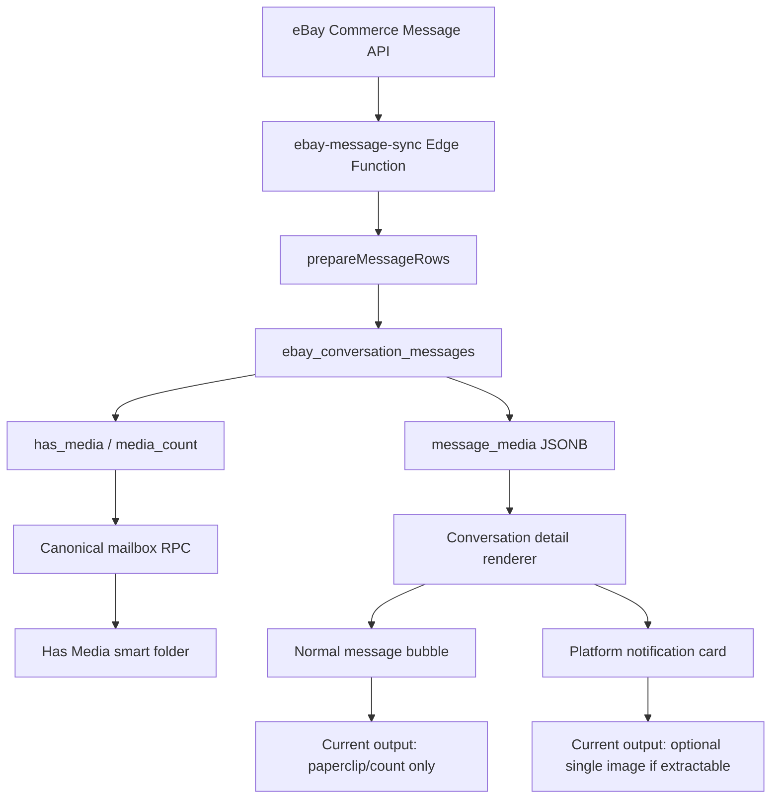

# Step 5F.6P.2C - Label Visibility, Folder Transparency, and Media Synchronization Audit

Audit date: 2026-06-08 local / 2026-06-09 UTC

Scope: current production-backed eBay Email Triage mailbox, smart folders, label display, custom folder editing, and message media rendering.

This step is audit-only. No application code changes were implemented.

## Validation Summary

Tools used:

- Playwright against `http://127.0.0.1:4173/email-triage.html`
- Authenticated Supabase browser session
- Direct read-only DB inspection through the page Supabase client
- Source inspection of frontend, migrations, and Edge Functions

Important validation results:

- Existing regression harness opened the authenticated app and validated canonical RPC/UI counts, unclassified queue, search, smart folder behavior, selected message persistence, and dashboard events before failing on a casing-sensitive read-state assertion.
- Regression failure detail: UI text contained `EBAY READ UNKNOWN`, `OG READ`, and `READ SYNC ALIGNED`; the test expected mixed-case `eBay`. This is a harness/text assertion fragility, not evidence of data corruption.
- Canonical mailbox RPC version observed: `v2_unclassified_participant_read_state`.
- Canonical conversations observed: `515`.
- Current classifications observed: `514`.
- Active saved views observed: `17` total: `16` system defaults plus one active custom folder named `test returns (system) + payment issue (AI)`.
- Temporary Playwright-created audit folders were soft-deleted after validation.

## Current Live Counts

### Smart Folder Counts

| Folder key | Count |
|---|---:|
| all | 515 |
| members | 308 |
| ebay_notifications | 207 |
| unread | 16 |
| unclassified | 1 |
| returns | 114 |
| shipping / shipping_issues | 136 |
| needs_reply_today | 297 |
| vip_buyers | 52 |
| high_value_buyers | 59 |
| refund_risk | 180 |
| review_queue | 408 |
| has_order | 390 |
| has_return | 67 |
| has_media | 46 |
| needs_context_review | 249 |

### AI Labels Currently Present

Current AI classification rows sampled: `514`.

Topics present:

| Topic | Count |
|---|---:|
| general_question | 117 |
| cancellation | 104 |
| return | 100 |
| platform_notice | 93 |
| refund_request | 88 |
| shipping_issue | 82 |
| buyer_complaint | 67 |
| order_status | 51 |
| not_as_described | 41 |
| missing_item | 38 |
| item_question | 33 |
| payment_issue | 33 |
| delivery_timing | 23 |
| custom_order_question | 10 |
| feedback_issue | 7 |
| address_change | 6 |
| wrong_item | 5 |
| offer_question | 4 |

Buyer flags present:

| Buyer flag | Count |
|---|---:|
| new_buyer | 355 |
| repeat_buyer | 95 |
| high_value_buyer | 59 |
| low_risk_buyer | 57 |
| high_retained_value_buyer | 52 |
| vip_buyer | 52 |
| high_return_risk_buyer | 45 |
| return_prone_buyer | 19 |

Risk flags present:

| Risk flag | Count |
|---|---:|
| context_review_needed | 296 |
| refund_risk | 177 |
| buyer_unhappy | 121 |
| cancellation_risk | 104 |
| negative_feedback_risk | 34 |
| chargeback_risk | 9 |
| return_escalation_risk | 3 |

Priority and response labels:

| Label group | Values |
|---|---|
| Priority | `high: 132`, `normal: 279`, `low: 103` |
| Response need | `reply_today: 297`, `reply_later: 84`, `no_reply_needed: 133` |
| Review state | `pending_review: 513`, `corrected: 1` |

### State Labels Currently Present

Conversation rows sampled: `515`.

| State label | Count |
|---|---:|
| Unread by `unread_count` | 16 |
| Provider unread | 16 |
| OG/local unread | 16 |
| Unclassified | 1 |
| Pending read sync | 0 |
| Read sync failed | 0 |

## Label Visibility Audit

Current detail panel rendering:

- AI labels are shown in the `AI Classification` section: Topics, Buyer Flags, Risk Flags, Priority, Response Status.
- System/deterministic labels are shown in the `System Labels` section: Source, Unread State, Context, Status, Review, Warning Explanation.
- Read-state labels are also visible as top detail badges: eBay read state, OG read state, read-sync alignment.
- Unclassified conversations show explicit `Unclassified` labels in the AI section.

Visibility gaps:

- Folder names are not always visible as the same label text that routed the conversation.
- `Returns` folder is a composite route: `Has Return` OR AI Topic `Return`. The operator may see `Has Return` or `Return`, but not an explicit `Returns` label.
- `Shipping` folder is a composite route over AI topics `shipping_issue`, `missing_item`, `order_status`, and `delivery_timing`. The operator sees the underlying AI topic, not a `Shipping` folder reason label.
- `Review Queue` is a composite state/system/AI route. The operator can see pieces of the cause, but not a single `Review Queue` reason label.
- `Members` and `eBay Notifications` are source routes. The detail panel shows `Member Message` or `Platform Notification`, not the exact folder label.
- Custom folder active chips show selected labels clearly, but the conversation detail does not show "this conversation matched custom folder X because of labels Y."

Verdict:

The current UI mostly exposes the underlying fields, but it does not yet satisfy the strict rule "no hidden folder-routing logic." Every folder-driving rule should produce an explicit visible reason label or reason row in the conversation detail.

## Folder Transparency Table

| Folder | Exact rule | Rule uses | Visible today? | Hidden or ambiguous? | Needs fix? |
|---|---|---|---|---|---|
| Members | `conversation_type = FROM_MEMBERS` | System/source | Partly: Source shows `Member Message` | Folder label `Members` is not shown as a folder reason | Yes |
| eBay Notifications | `conversation_type = FROM_EBAY` | System/source | Partly: Source shows `Platform Notification` | Folder label `eBay Notifications` is not shown as a folder reason | Yes |
| Returns | `has_return_link OR topic_tags contains return` | System + AI | Partly: `Has Return` or AI Topic `Return` can show | Composite route is not explained as `Returns` | Yes |
| Shipping | `topic_tags overlaps shipping_issue, missing_item, order_status, delivery_timing` | AI | Partly: underlying topic is visible | Folder says `Shipping`; detail may show only `Order Status` or `Delivery Timing` | Yes |
| Reply Today | `response_need = reply_today` | AI/state-like response | Yes: Response Status shows `Reply Today` | Folder name and label mostly align | No, minor wording only |
| VIP Buyers | `buyer_flags contains vip_buyer` | AI | Yes: Buyer Flags shows `Vip Buyer` | No major hidden logic | No |
| High Value | `buyer_flags overlaps high_value_buyer, high_retained_value_buyer` | AI | Yes: underlying buyer flag is visible | Folder name is broader than exact flag | Minor |
| Refund Risk | `risk_flags overlaps refund_risk, chargeback_risk, unsupported_claim_risk` | AI | Yes: risk flags are visible when present | `unsupported_claim_risk` is allowed in UI constants but not observed in DB sample | Minor |
| Review Queue | `unclassified OR no links OR suggested links OR stale classification OR context_review_needed OR low_confidence` | State + system + AI | Partly: Unclassified, Needs Review, stale, and risk flags can show | No single `Review Queue` reason label; suggested-link cause is only indirect via warning | Yes |
| Has Order | `has_order_link` | System | Yes: Context shows `Has Order` | No | No |
| Has Return | `has_return_link` | System | Yes: Context shows `Has Return` | No | No |
| Has Media | `has_media` from message stats | System | Yes: Context shows `Has Media`; messages show media count | Images are not rendered for normal member messages | Yes for media display, not label visibility |
| Needs Review | `link_count = 0 OR suggested_link_count > 0` | System | Yes: Review shows `Needs Review`; warnings explain no/suggested links | The exact no-link vs suggested-link route is not presented as a folder reason | Minor |

## Root Causes

### Root Cause 1 - Folder Rules Are Not Projected As First-Class Labels

The canonical RPC computes folder inclusion from conversation fields, classification arrays, link stats, and message stats. The detail panel independently renders AI and system metadata. There is no shared "folder reason labels" projection.

Relevant source:

- `get_ebay_canonical_mailbox_v2` filters by `v_system_filter`.
- `email-triage.js` renders system labels in `ebaySystemLabelGroups`.
- `email-triage.js` renders AI labels in `renderEbayAiLabelSection`.

Because those two paths are separate, the folder rail can say `Returns` while the detail panel says only `Has Return` or AI Topic `Return`.

### Root Cause 2 - Composite Folders Hide Their Boolean Structure

Folders like `Returns`, `Shipping`, `Refund Risk`, `High Value`, and `Review Queue` are intentionally composite. Composite folders are useful, but they need visible reason rows:

```text
Folder Reasons
  Returns: matched by AI Topic Return
  Review Queue: matched by Suggested links need review
```

Without this, the operator has to know the implementation.

### Root Cause 3 - Smart Folder Edit Mode Is Functionally Present But Visually Thin

Observed current behavior:

- Edit toggle changes to `Done`.
- Per-folder edit icons appear.
- Draft rows show rule summaries.
- Cancel works and preserves the saved DB definition.
- Save works and persists the changed definition.
- No `SMART FOLDER EDIT MODE` banner exists.
- No reset-to-saved control exists.
- The draft row count can be misleading when the currently loaded row set came from another custom folder. In the Playwright edit test, the saved VIP + Return folder had `16` matches, but the draft row showed `0` while editing from a zero-result folder state.

### Root Cause 4 - Message Media URLs Are Stored But Not Rendered For Normal Messages

Observed live media data:

- `77` `ebay_conversation_messages` rows sampled with `has_media = true`.
- All `77` had non-empty `message_media` arrays.
- All `77` had URL-bearing media records.
- Media record shape was consistently `mediaName | mediaType | mediaUrl`.
- URL host sampled: `i.ebayimg.com`.
- `Has Media` folder count: `46` conversations.

Observed UI behavior:

- Opening `Has Media` showed `46` matching conversations.
- Selected Has Media detail rendered `0` images.
- Detail rendered media text/count indicators.

Source behavior:

- Sync stores `message_media`, `has_media`, and `media_count`.
- Normal chat bubble only renders a paperclip/count for media.
- Notification cards can render one image via `extractEbayNotificationImage`, but normal member-message media does not render thumbnails.

## Folder Edit UX Validation

Playwright-created temporary folders:

| Test folder | Definition | Initial count | Reload count | Result |
|---|---|---:|---:|---|
| `Audit 5F6P2C VIP Return ...` | Topic `return` + Buyer Flag `vip_buyer` | 16 | 16 | Stable |
| `Audit 5F6P2C Return Risk ...` | Buyer Flags `return_prone_buyer`, `high_return_risk_buyer`, `high_retained_value_buyer` | 0 | 0 | Stable |

Verified:

- Create folder through UI: passed.
- Add labels through UI filters: passed.
- Folder chip shows labels/count: passed.
- Reload preserves folder chip/count/rules: passed.
- Cancel edit discards draft and preserves DB row: passed.
- Save edit persists new definition: passed.
- Temporary rows were soft-deleted after validation.

Needs fix:

- Add obvious edit-mode banner/styling.
- Add Reset to Saved Folder.
- Make destructive label removal harder to do accidentally while in a folder draft.
- Recompute custom draft counts from the server or label them as draft-local counts.

## Media Architecture Diagram



## Media Audit Answers

1. Does eBay provide media URLs?

Yes. Sampled rows contain `mediaUrl` values on `message_media` records.

2. Are media URLs stored?

Yes. They are stored in `ebay_conversation_messages.message_media` as JSONB. Sample shape: `mediaName`, `mediaType`, `mediaUrl`.

3. Are images downloaded?

No evidence found. Current architecture stores provider URLs and message metadata, not downloaded image files or Supabase Storage paths for eBay message media.

4. Are images linked to messages?

Yes. Media is linked directly to each message row through `message_media`, `has_media`, and `media_count`.

5. Why are images visible in eBay but not visible in OG?

Because normal member-message rendering does not render `message_media` URLs as images. It only shows a media count in the message foot. Platform notifications have a separate image extractor, but the selected Has Media sample was a normal member conversation and rendered `0` images despite stored media URLs.

## Exact Fix Plan

### Fix 1 - Add Folder Reason Labels

Add a shared label projection used by both RPC payloads and conversation detail:

```text
folder_reason_labels: [
  { folder: "Returns", reason: "AI Topic: Return" },
  { folder: "Has Media", reason: "System Label: Has Media" }
]
```

Implementation options:

- Preferred: extend `get_ebay_canonical_mailbox_v2` summary JSON to include `folder_reasons` for the active row.
- Frontend fallback: compute the same reason list client-side from the already-returned classification and summary fields.

Acceptance criteria:

- Every built-in folder that includes a conversation has at least one visible detail-panel reason.
- Folder reason labels use the same human text as the folder rail.
- Composite folders show which branch matched.

### Fix 2 - Normalize Label Taxonomy

Keep three visible groups:

- AI Labels: topics, buyer flags, risk flags, priority, response status.
- System Labels: source, Has Order, Has Return, Has Media, Has Listing, Needs Review.
- State Labels: Read, Unread, Unclassified, Review Queue, Needs Reply Today, Pending Read Sync, Read Sync Failed.

Do not rely on folder names alone. A conversation in a folder should show a corresponding reason in detail.

### Fix 3 - Smart Folder Edit UX

Add:

- A high-contrast `SMART FOLDER EDIT MODE` banner in the folder rail.
- Draft styling on the active folder and filter chips.
- `Reset` button for active draft: restore last saved `filter_payload` while staying in edit mode.
- `Save` button: persist draft.
- `Cancel` button: discard draft.
- Confirmation when removing the last label from a custom folder or changing from a non-empty folder to zero-match rules.

### Fix 4 - Render Member Message Media

Render `message_media` for normal message bubbles:

- Use `mediaUrl` as the image source.
- Show thumbnail grid inside the message bubble under the text.
- Link thumbnails to the original URL in a new tab.
- Use `mediaName` for alt text when present.
- Lazy-load images.
- Allow only safe `http`/`https` URLs and preferably allowlist `i.ebayimg.com` unless other provider hosts are observed.
- Preserve the current paperclip/count as compact metadata.

No migration is required for basic rendering because URLs are already stored.

### Fix 5 - Decide Whether To Cache Media

Provider URL rendering is the fastest beta fix. Download/caching is a separate decision:

- If eBay image URLs are durable enough, render URLs directly.
- If URLs expire or require authenticated access, add an Edge Function media cache:
  - Fetch media server-side.
  - Store in a private Supabase Storage bucket.
  - Link storage object metadata back to `ebay_conversation_messages`.
  - Render signed URLs in the UI.

## Regression Risks

- Adding folder reason labels can duplicate or conflict with existing AI/System labels if copy is not normalized.
- Composite folder reason display can become noisy on heavily labeled conversations.
- Server-side reason projection increases RPC payload size.
- Client-side reason projection risks drifting from RPC logic unless tests cover every folder branch.
- Rendering external media URLs can expose broken images, mixed content if URLs are malformed, or layout shifts if dimensions are unknown.
- Downloading/caching media adds storage, retention, privacy, and provider-rate-limit responsibilities.
- Smart folder reset/save/cancel changes touch operator workflow and should be covered with Playwright before deploy.

## Deployment Requirements

For the proposed fixes:

- Frontend deploy required for detail-panel folder reasons, smart folder edit UX, and member media rendering.
- Database migration optional if folder reasons are added to the canonical RPC payload.
- Edge Function deploy not required for direct URL media rendering.
- Edge Function deploy and storage configuration required only if media caching/downloading is chosen.
- Regression harness update required for the read-state casing assertion.

## Updated Beta Readiness

Backend sync/count/read-state readiness remains strong. The canonical mailbox count, unclassified queue, saved folder persistence, and custom folder reload behavior are working.

Operator-facing beta readiness is not clear yet because:

- Folder-routing reasons are not explicit enough for composite folders.
- Smart folder edit mode lacks obvious mode signaling and reset behavior.
- Has Media routes correctly but does not render member-message images.
- The regression harness has a casing-sensitive assertion that should be repaired before it is used as a release gate.

Updated readiness estimate:

```text
Overall beta readiness: 86%
Backend/data readiness: 92%
Operator transparency/media readiness: 78%
```

Beta can proceed only after either:

- label/folder reason visibility and media rendering are fixed, or
- operators are explicitly told that Has Media currently means "media stored, thumbnails not yet rendered."

